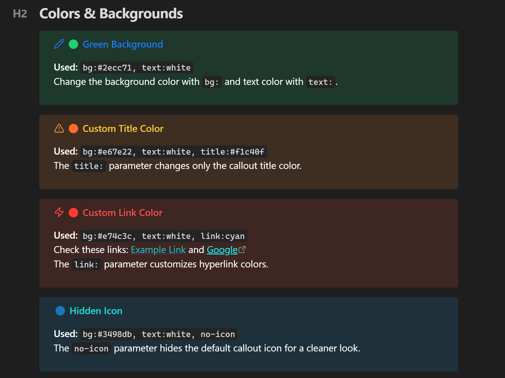
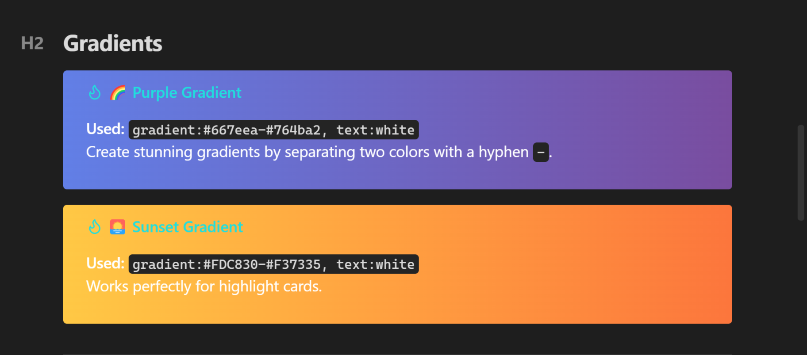
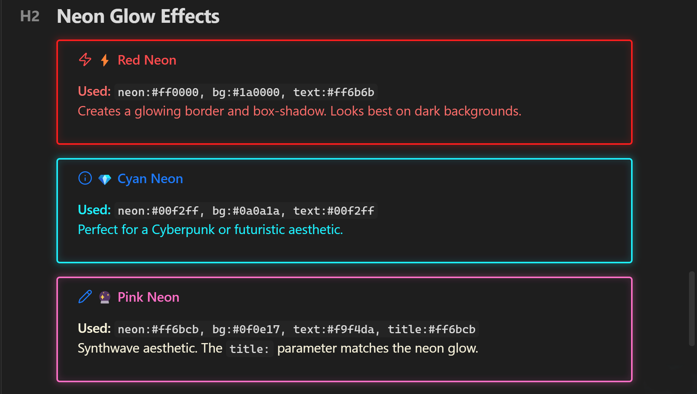
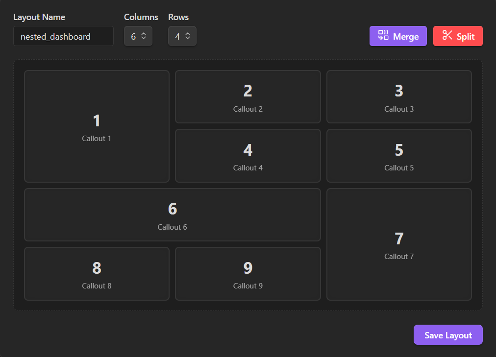
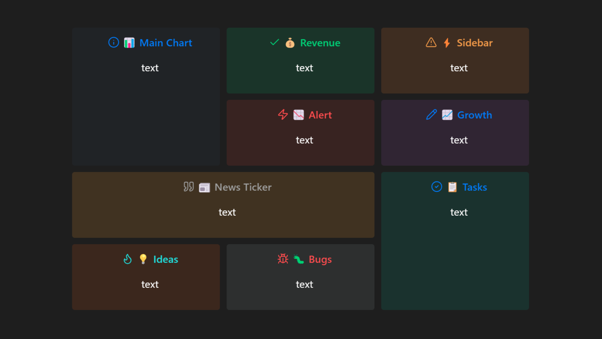
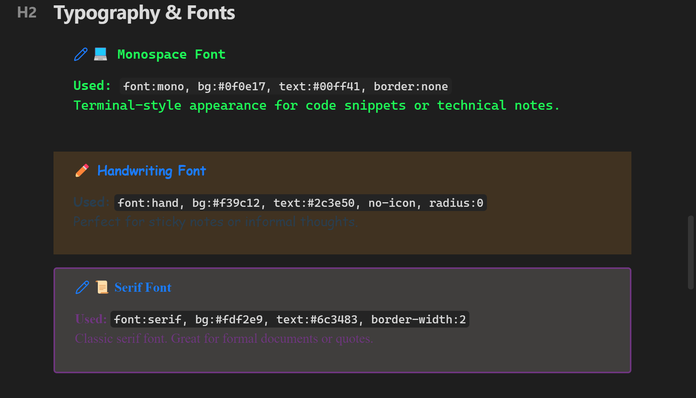
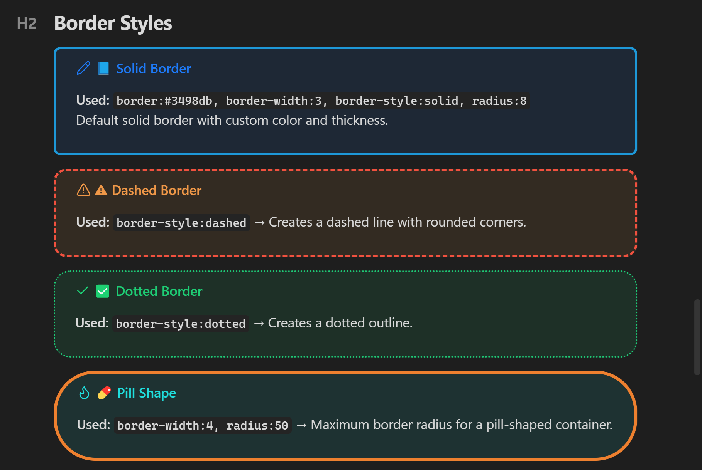
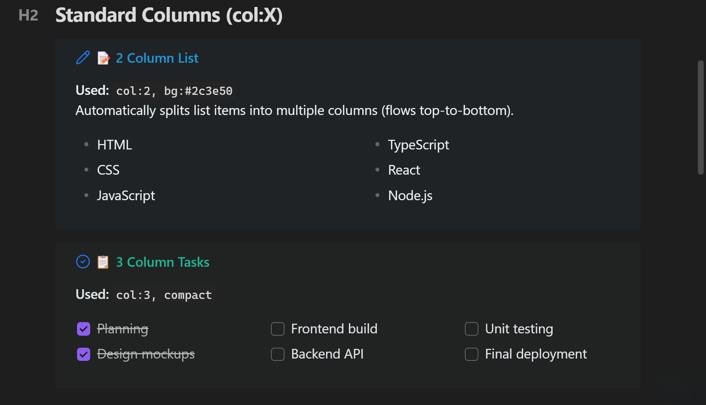

  
  
  
  
  
  
  

  <a href="USAGE_GUIDE.md">Guía de Uso</a> · <a href="README_TR.md">Türkçe</a> · <a href="https://github.com/ahseyg/special-callouts/issues">Informar error</a>

# Special Callouts para Obsidian

Transforma tus notas de Obsidian con *callouts* premium, dinámicos y totalmente personalizables. Convierte casillas genéricas en diseños de calidad editorial, terminales de código o alertas con brillo neón. Personaliza todo directamente desde tu markdown o crea plantillas reutilizables en el panel de configuración visual.

**Código abierto** · Licencia MIT · Se aceptan contribuciones

---

## Características

- **Personalización en línea** — fondo, texto, borde, degradado, neón, icono — directamente en markdown
- **Preajustes de estilo personalizados** — diseña una vez, reutiliza por nombre
- **Listas de varias columnas** — divide cualquier lista en 2–4 columnas
- **Constructor de diseño visual** — diseñador de cuadrículas con arrastrar y combinar
- **Control tipográfico** — 5 familias de fuentes, 5 escalas de tamaño
- **Efectos neón y degradados** — bordes luminosos, transiciones de color suaves
- **Integración con Dataview** — los diseños de columnas funcionan con consultas de Dataview
- **Importación/Exportación** — comparte estilos como JSON entre bóvedas

---

## Capturas de pantalla y capacidades de diseño

Explora las posibilidades de personalización sin fin. 

### Colores, degradados y efectos

> [Aprende a crear fondos y colores de texto personalizados en la Guía de Uso](USAGE_GUIDE.md#colors--backgrounds)

> [Aprende a crear fondos degradados en la Guía de Uso](USAGE_GUIDE.md#gradient-background--gradient)

> [Aprende a crear efectos de brillo neón en la Guía de Uso](USAGE_GUIDE.md#visual-effects)

### Constructor de diseño visual

Diseña cuadrículas complejas de panel arrastrando y combinando celdas: no se requiere código. Accede desde **Configuración → Special Callouts → Constructor de diseño visual**.

> [Aprende a usar el Constructor de diseño visual en la Guía de Uso](USAGE_GUIDE.md#1-visual-layout-builder)

### Cuadrículas de panel

Usa el constructor visual o la sintaxis en línea de cuadrículas para crear diseños de múltiples paneles. Los *callouts* se colocan automáticamente en las áreas combinadas que diseñaste.

> [Aprende a crear cuadrículas de panel con múltiples callouts en la Guía de Uso](USAGE_GUIDE.md#grid-layout-multi-callout)

### Tipografía y bordes

> [Aprende a cambiar fuentes y tamaños en la Guía de Uso](USAGE_GUIDE.md#typography)

> [Aprende a personalizar bordes y radios en la Guía de Uso](USAGE_GUIDE.md#borders--shapes)

### Listas de varias columnas

> [Aprende a dividir listas en varias columnas en la Guía de Uso](USAGE_GUIDE.md#multi-column-lists)

---

## Referencia de metadatos

`> [!type] (param:value, param2:value2) Título`

### Colores
| Parámetro | Ejemplo | Descripción |
| :--- | :--- | :--- |
| `bg` | `bg:#ff0000` | Color de fondo |
| `text` | `text:white` | Color del texto del contenido |
| `title` | `title:cyan` | Color del título y el icono |
| `link` | `link:orange` | Color de los enlaces |
| `gradient` | `gradient:blue-purple` | Degradado de dos colores |
| `neon` | `neon:#00f2ff` | Borde neón + brillo |
| `icon` | `icon:sun` | Nombre del icono de Lucide |
| `no-icon` | `(no-icon)` | Ocultar icono |

### Bordes
| Parámetro | Ejemplo | Descripción |
| :--- | :--- | :--- |
| `border` | `border:red` | Color del borde |
| `border-width` | `border-width:4` | Grosor (px) |
| `border-style` | `border-style:dashed` | `solid`, `dashed`, `dotted`, `double` |
| `radius` | `radius:20` | Redondeo de esquinas (px) |

### Tipografía
| Parámetro | Ejemplo | Descripción |
| :--- | :--- | :--- |
| `font` | `font:mono` | `mono`, `serif`, `sans`, `hand`, `marker` |
| `font-size` | `font-size:4` | `1` (muy pequeño) → `5` (muy grande) |

### Diseño
| Parámetro | Ejemplo | Descripción |
| :--- | :--- | :--- |
| `col` | `(col:3)` | Listas de varias columnas |
| `center` | `(center)` | Centrar contenido |
| `compact` | `(compact)` | Reducir relleno |
| `dense` | `(dense)` | Reducir interlineado |
| Grid | `(1:2)` | Posición en la cuadrícula |

Referencia completa en la [Guía de Uso](USAGE_GUIDE.md).

---

## Instalación

### Complementos de la comunidad (Recomendado)

1. **Configuración → Complementos de la comunidad**
2. Desactiva el Modo restringido
3. Explorar → buscar **Special Callouts**
4. Instalar → Habilitar

O abre directamente: [community.obsidian.md/plugins/special-callouts](https://community.obsidian.md/plugins/special-callouts)

### Instalación manual

1. Descarga `main.js`, `styles.css`, `manifest.json` desde el [último lanzamiento](https://github.com/ahseyg/special-callouts/releases)
2. Crea `VaultFolder/.obsidian/plugins/special-callouts/`
3. Copia los archivos en la carpeta
4. Habilítalo en Configuración → Complementos de la comunidad

---

## Contribuciones

- **Informes de errores:** [Abre un issue](https://github.com/ahseyg/special-callouts/issues) — incluye la versión de Obsidian, el markdown del callout y una captura de pantalla
- **Solicitudes de funciones:** [Abre un issue](https://github.com/ahseyg/special-callouts/issues)
- **Pull requests:** Fork → Rama → Código → PR

Si encuentras útil este complemento, considera darle una [estrella](https://github.com/ahseyg/special-callouts).

---

## Licencia

MIT — Consulta [LICENSE](LICENSE) para más detalles.

---

  Desarrollado por <a href="https://github.com/ahseyg">ahseyg</a>

