# Special Callouts for Obsidian

**Transform your Obsidian notes with premium, dynamic, and fully customizable callouts.**

Turn boring generic boxes into magazine-quality layouts, code terminals, or neon-glowing alerts. Customize everything directly from your markdown — or create reusable presets in the visual settings panel.

**Open source** · MIT License · Contributions welcome!

---

## What's New in v1.0.2

| Feature | Description |
|---------|-------------|
| **Center Alignment** | `(center)` to center everything, `(title:center)` for title only |
| **Compact Mode** | `(compact)` for dashboard-style dense layouts |
| **Typography System** | Five fonts: `mono`, `serif`, `sans`, `hand`, `marker` |
| **Font Size Scale** | `font-size:1` (tiny) → `font-size:5` (huge) |
| **Neon Glow** | Color-based neon borders: `neon:#00f2ff` |
| **Text Borders** | `text:dark-border` / `light-border` for readability |
| **Border Styles** | `dashed`, `dotted`, `double` with custom `radius` |
| **Column Engine Rewrite** | CSS Grid-based reliable multi-column lists |
| **Dataview Support** | Column layouts work with Dataview task/list queries |
| **Reading Mode Fixes** | Multi-callouts no longer overlap in preview |
| **Random Style Generator** | One-click random style in settings |

---

## Features at a Glance

- **Infinite Customization** — Background, text, borders, icons — all from inline markdown
- **Advanced Layouts** — Multi-column lists, side-by-side grids, dashboards
- **Typography Control** — Switch fonts and sizes per callout
- **Visual Effects** — Gradients, neon glows, custom borders
- **Center & Compact** — Center-align content or shrink padding for dense views
- **Dataview Integration** — Column layouts work with Dataview tasks and lists
- **Visual Settings Panel**:
    - Live Preview while editing styles
    - Visual Icon Picker with fuzzy search
    - Random Style Generator
    - Import/Export styles as JSON
    - Standard callout customization (note, info, warning, etc.)
    - Custom named color palette

> **[Full Usage Guide →](USAGE_GUIDE.md)** — Detailed documentation for every feature.

---

## Quick Start

### 1. Inline Customization

Add parameters inside parentheses `( )` right after the callout type:

```markdown
> [!note] (bg:#2ecc71, text:white) Hello World
> This is a green callout with white text.
```

### 2. Custom Style Presets

Create a style in **Settings → Special Callouts**, name it (e.g., `terminal`), and use it anywhere:

```markdown
> [!terminal]
> System ready.
> Waiting for command...
```

Or apply it to any standard callout:

```markdown
> [!info] (style:terminal)
> This info box now looks like a terminal!
```

---

## Metadata Reference

Customize any callout: `> [!type] (param:value, param2:value2) Title`

### Colors & Visuals
| Parameter | Example | Description |
| :--- | :--- | :--- |
| `bg` | `bg:blue` / `bg:#ff0000` | Background color |
| `text` | `text:white` | Content text color |
| `title` | `title:cyan` | Title text and icon color |
| `link` | `link:orange` | Link color inside callout |
| `gradient` | `gradient:blue-purple` | 2-color linear gradient |
| `neon` | `neon:#00f2ff` | Neon border + glow effect |
| `no-icon` | `(no-icon)` | Hide the default icon |

### Borders
| Parameter | Example | Description |
| :--- | :--- | :--- |
| `border` | `border:red` / `border:none` | Border color |
| `border-width` | `border-width:4` | Thickness in pixels |
| `border-style` | `border-style:dashed` | `solid`, `dashed`, `dotted`, `double` |
| `radius` | `radius:20` | Corner roundness in pixels |

### Typography
| Parameter | Example | Description |
| :--- | :--- | :--- |
| `font` | `font:mono` | `mono`, `serif`, `sans`, `hand`, `marker` |
| `font-size` | `font-size:4` | Scale: `1` (tiny) → `5` (huge). Default: `3` |

### Text Readability
| Parameter | Example | Description |
| :--- | :--- | :--- |
| `text:dark-border` | `text:(white, dark-border)` | Dark stroke on content text |
| `text:light-border` | `text:(cyan, light-border)` | Light stroke on content text |
| `title:dark-border` | `title:(yellow, dark-border)` | Dark stroke on title |
| `link:dark-border` | `link:(orange, dark-border)` | Dark stroke on links |

### Layouts
| Parameter | Example | Description |
| :--- | :--- | :--- |
| `col` | `(col:3)` | Multi-column lists |
| `center` | `(center)` | Center title + content |
| `title:center` | `(title:center)` | Center only the title |
| `compact` | `(compact)` | Reduce padding (dense mode) |
| Grid | `(1:2)` | Position in grid: `(pos:cols)` |
| Grid Row | `(1:3:2)` | `(pos:cols:row)` for multi-row |

---

## Examples

> Each example below shows the **exact markdown syntax** used to create it. Copy-paste into Obsidian to try!

### Colors & Backgrounds
Change background, text, and title colors using Hex codes, RGB, or named colors.

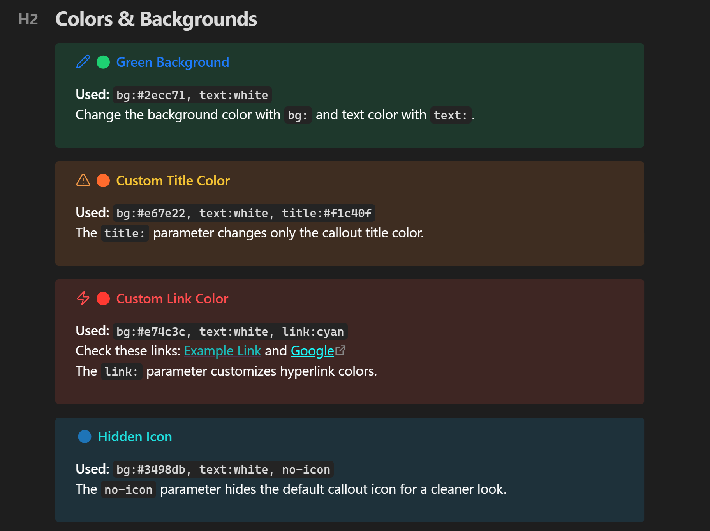

```markdown
> [!note] (bg:#2ecc71, text:white) 🟢 Green Background
> Change the background color with `bg:` and text color with `text:`.

> [!warning] (bg:#e67e22, text:white, title:#f1c40f) 🟠 Custom Title Color
> The `title:` parameter changes only the callout title color.

> [!danger] (bg:#e74c3c, text:white, link:cyan) 🔴 Custom Link Color
> Check these links: [[Example Link]] and [Google](https://google.com)
> The `link:` parameter customizes hyperlink colors.

> [!tip] (bg:#3498db, text:white, no-icon) 🔵 Hidden Icon
> The `no-icon` parameter hides the default callout icon for a cleaner look.
```

---

### Gradients
Create stunning gradients by separating two colors with a hyphen `-`.

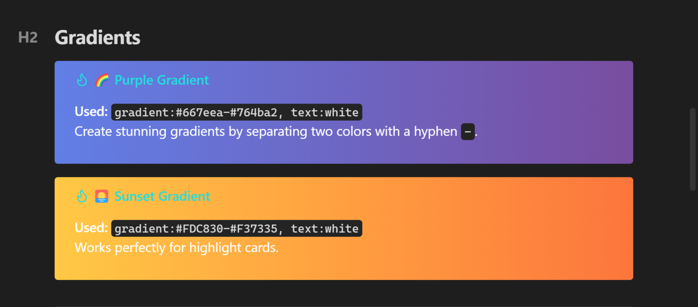

```markdown
> [!tip] (gradient:#667eea-#764ba2, text:white) 🌈 Purple Gradient
> Create stunning gradients by separating two colors with a hyphen `-`.

> [!tip] (gradient:#FDC830-#F37335, text:white) 🌅 Sunset Gradient
> Works perfectly for highlight cards.
```

---

### Typography & Fonts
Change the font family of your callouts to match the content.

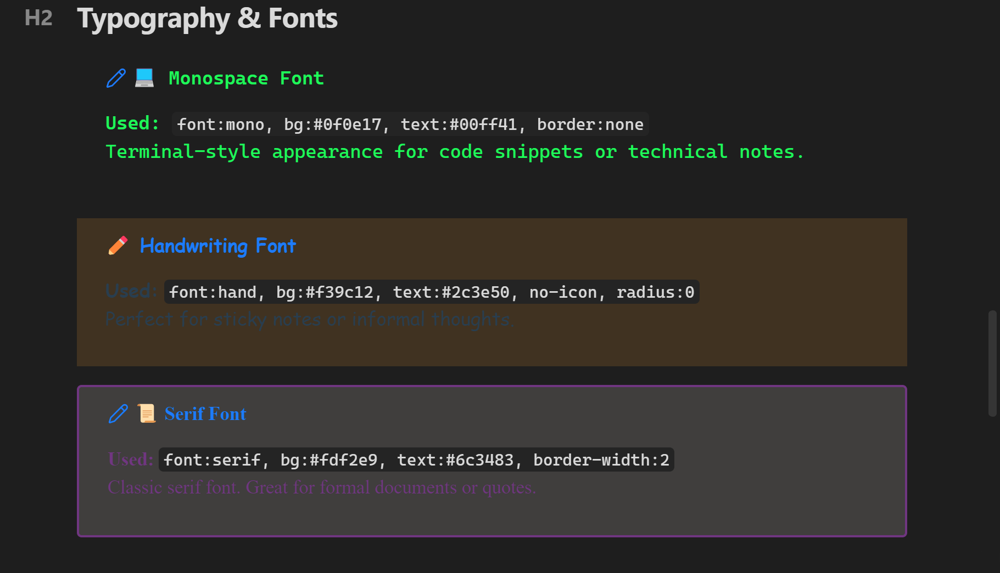

```markdown
> [!note] (font:mono, bg:#0f0e17, text:#00ff41, border:none, title:#00ff41) 💻 Monospace Font
> Terminal-style appearance for code snippets or technical notes.

> [!note] (font:hand, bg:#f39c12, text:#2c3e50, no-icon, radius:0) ✏️ Handwriting Font
> Perfect for sticky notes or informal thoughts.

> [!note] (font:serif, bg:#fdf2e9, text:#6c3483, border-width:2) 📜 Serif Font
> Classic serif font. Great for formal documents or quotes.
```

---

### Font Size Scale
Scale text from `font-size:1` (tiny) to `font-size:5` (huge).

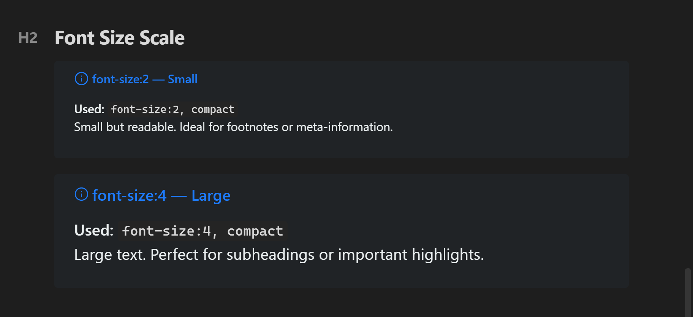

```markdown
> [!info] (font-size:2, bg:#2c3e50, text:#ecf0f1, compact) font-size:2 — Small
> Small but readable. Ideal for footnotes or meta-information.

> [!info] (font-size:4, bg:#2c3e50, text:#ecf0f1, compact) font-size:4 — Large
> Large text. Perfect for subheadings or important highlights.
```

---

### Layout Controls
Center alignment and compact dense modes.

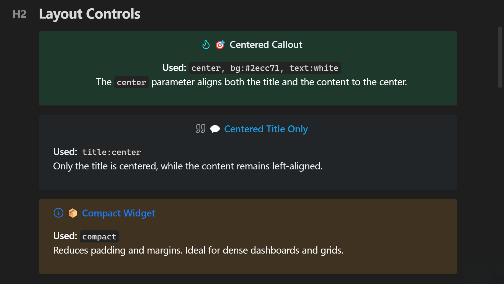

```markdown
> [!tip] (center, bg:#2ecc71, text:white, title:#ecf0f1) 🎯 Centered Callout
> The `center` parameter aligns both the title and the content to the center.

> [!quote] (title:center, bg:#34495e, text:#ecf0f1, title:#3498db) 💬 Centered Title Only
> Only the title is centered, while the content remains left-aligned.

> [!info] (compact, bg:#f39c12, text:white) 📦 Compact Widget
> Reduces padding and margins. Ideal for dense dashboards and grids.
```

---

### Border Styles
Customize border style, width, and radius.

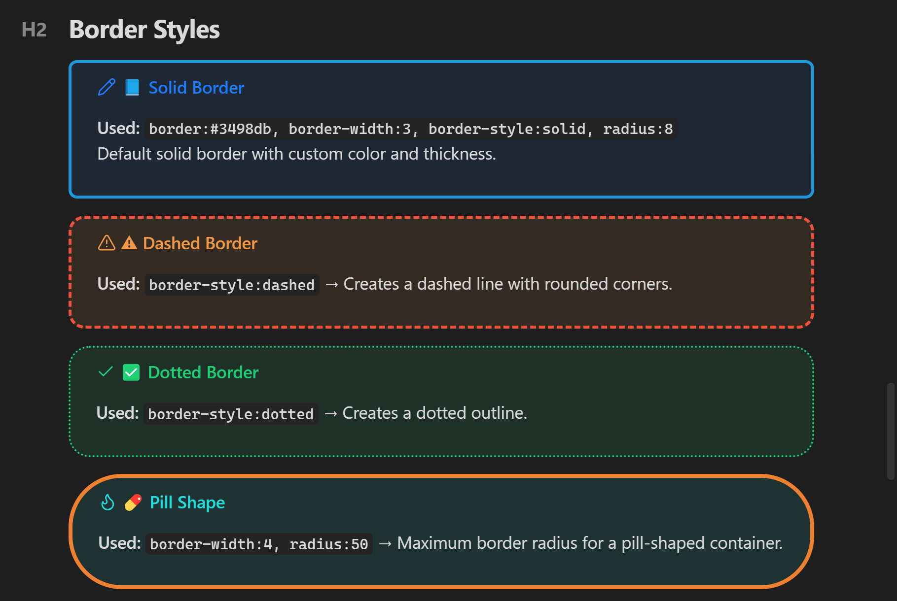

```markdown
> [!note] (border:#3498db, border-width:3, border-style:solid, radius:8) 📘 Solid Border
> Default solid border with custom color and thickness.

> [!warning] (border:#e74c3c, border-width:3, border-style:dashed, radius:15) ⚠️ Dashed Border
> `border-style:dashed` → Creates a dashed line with rounded corners.

> [!success] (border:#2ecc71, border-width:2, border-style:dotted, radius:20) ✅ Dotted Border
> `border-style:dotted` → Creates a dotted outline.

> [!tip] (border:#e67e22, border-width:4, radius:50) 💊 Pill Shape
> `border-width:4, radius:50` → Maximum border radius for a pill-shaped container.
```

---

### Neon Glow Effects
Add futuristic neon borders and glowing box-shadows.

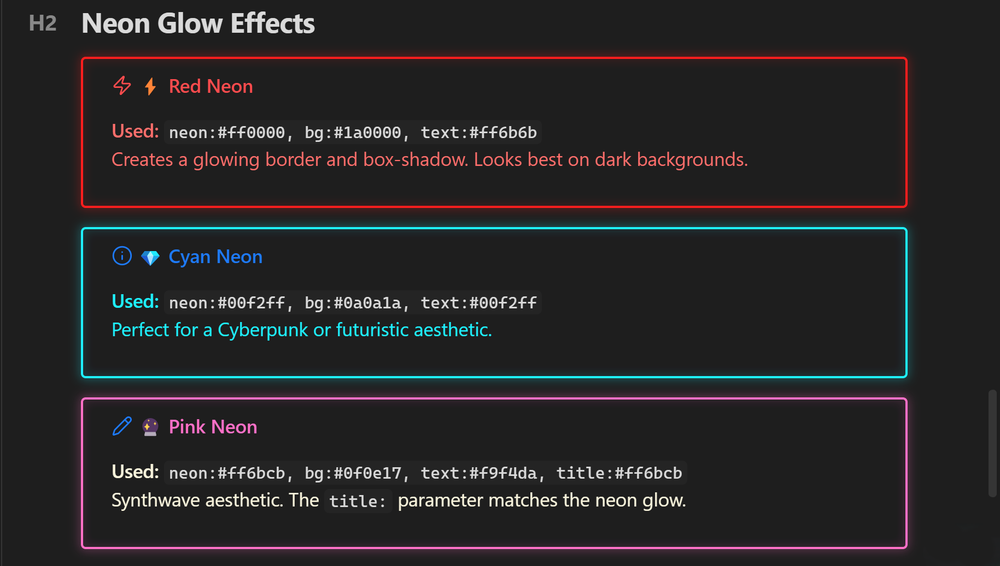

```markdown
> [!danger] (neon:#ff0000, bg:#1a0000, text:#ff6b6b) ⚡ Red Neon
> Creates a glowing border and box-shadow. Looks best on dark backgrounds.

> [!info] (neon:#00f2ff, bg:#0a0a1a, text:#00f2ff) 💎 Cyan Neon
> Perfect for a Cyberpunk or futuristic aesthetic.

> [!note] (neon:#ff6bcb, bg:#0f0e17, text:#f9f4da, title:#ff6bcb) 🔮 Pink Neon
> Synthwave aesthetic. The `title:` parameter matches the neon glow.
```

---

### Standard Columns
Automatically split list items and checkboxes into multiple columns.

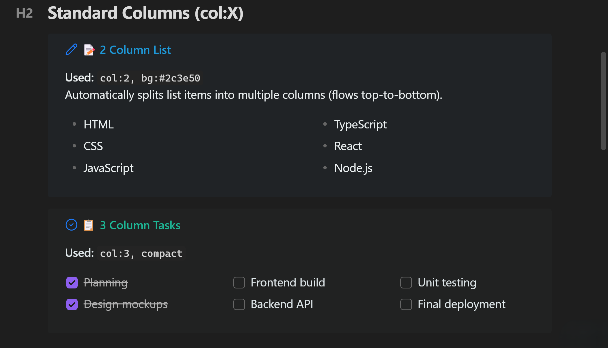

```markdown
> [!note] (col:2, bg:#2c3e50, text:#ecf0f1, title:#3498db) 📝 2 Column List
> Automatically splits list items into multiple columns (flows top-to-bottom).
> - HTML
> - CSS
> - JavaScript
> - TypeScript
> - React
> - Node.js

> [!todo] (col:3, bg:#2d3436, text:#dfe6e9, title:#00b894, compact) 📋 3 Column Tasks
> Task lists (checkboxes) work flawlessly inside column layouts!
> - [x] Planning
> - [x] Design mockups
> - [ ] Frontend build
```

---

### Dataview Integration
Column layouts perfectly support asynchronous Dataview queries!

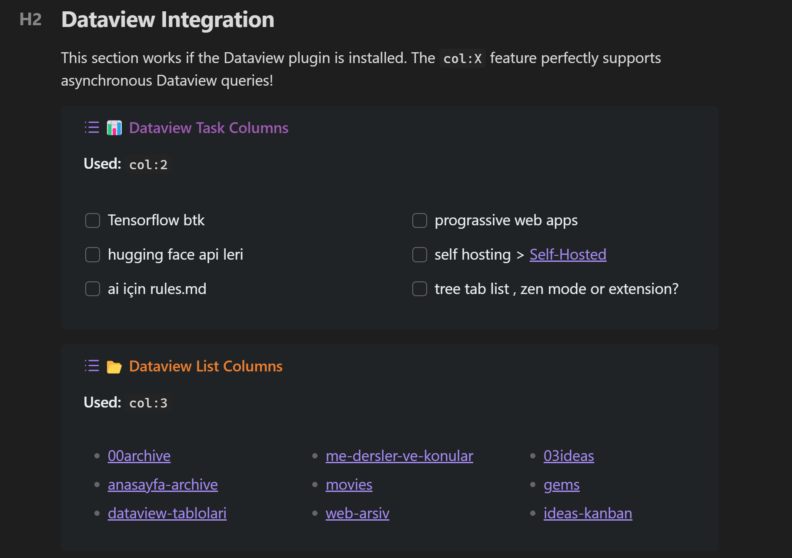

````markdown
> [!example] (col:2, bg:#2c3e50, text:#ecf0f1, title:#9b59b6) 📊 Dataview Task Columns
> ```dataview
> TASK 
> FROM "" 
> WHERE !completed 
> LIMIT 6
> ```
````

---

## The Two Layout Engines: Inline vs Visual

Special Callouts comes with **two distinct layout engines**. Depending on your needs, you can use the simple inline system for quick alignments, or the advanced visual builder for complex, asymmetric dashboards.

### 1. The Inline Grid System (Basic & Quick)
**Best for:** Simple side-by-side grids, 50/50 splits, or quick alignments.
**How it works:** You write the layout directly in your markdown using the `(position:columns)` syntax inside a `[!multi-callout]` wrapper. No settings required.

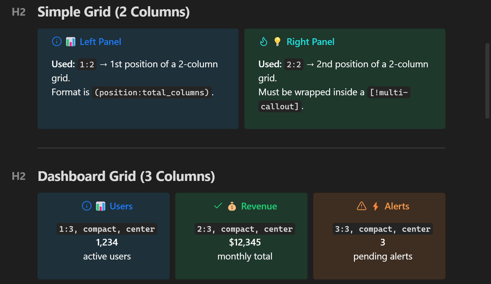

```markdown
> [!multi-callout]
> > [!info] (1:2, bg:#3498db, text:white) 📊 Left Panel
> > Format is `(position:total_columns)`.
>
> > [!tip] (2:2, bg:#2ecc71, text:white) 💡 Right Panel
> > Must be wrapped inside a `[!multi-callout]`.
```

---

### 2. The Visual Layout Builder (Advanced & Interactive)
**Best for:** Complex dashboards, asymmetric designs, nested columns, and merged grids.
**How it works:** Instead of writing complex layout math in markdown, you design your grid visually in the Plugin Settings. It works just like Excel or Elementor: **drag to select cells, click "Merge"**, and visually build your layout!

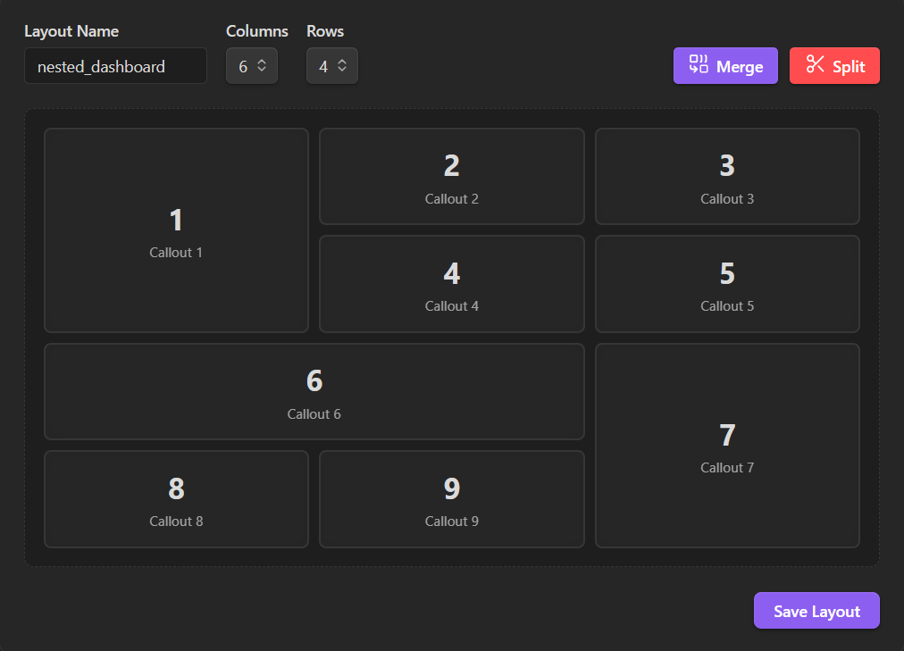
*(Go to Settings -> Special Callouts -> Visual Layout Builder to try the drag-and-merge interface)*

Once you save your layout with a name (e.g., `my_dashboard`), simply call it in your markdown. The system automatically places your callouts into the merged areas you designed.

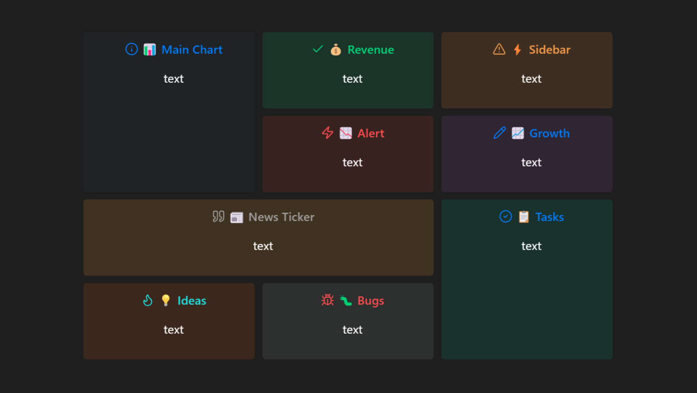

```markdown
> [!multi-callout] (nested_dashboard)
>
> > [!info] (bg:#2c3e50, text:white, center, compact) 📊 Main Chart
> > text
>
> > [!success] (bg:#27ae60, text:white, center, compact) 💰 Revenue
> > text
>
> > [!warning] (bg:#e67e22, text:white, center, compact) ⚡ Sidebar
> > text
>
> > [!danger] (bg:#c0392b, text:white, center, compact) 📉 Alert
> > text
>
> > [!note] (bg:#8e44ad, text:white, center, compact) 📈 Growth
> > text
>
> > [!quote] (bg:#f39c12, text:white, center, compact) 📰 News Ticker
> > text
>
> > [!todo] (bg:#16a085, text:white, center, compact) 📋 Tasks
> > text
>
> > [!tip] (bg:#d35400, text:white, center, compact) 💡 Ideas
> > text
>
> > [!bug] (bg:#7f8c8d, text:white, center, compact) 🐛 Bugs
> > text
```

---

### Mixed Grid
Combine columns inside grids!

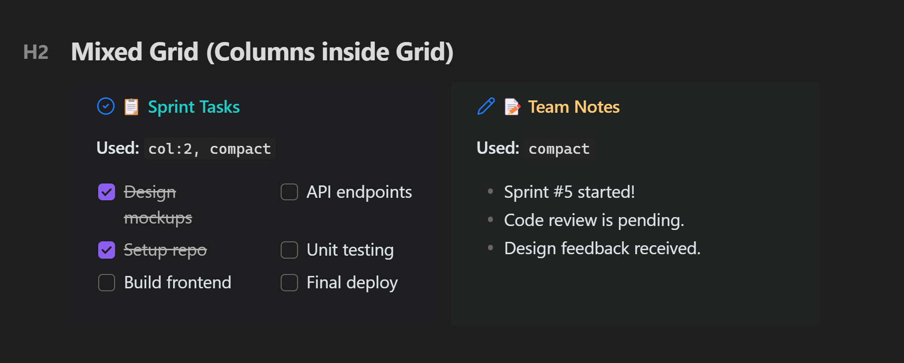

```markdown
> [!multi-callout]
> > [!todo] (1:2, col:2, bg:#1a1a2e, text:#dfe6e9, title:#00cec9, compact) 📋 Sprint Tasks
> > - [x] Design mockups
> > - [x] Setup repo
> > - [ ] Build frontend
> > - [ ] API endpoints
>
> > [!note] (2:2, bg:#2d3436, text:#dfe6e9, title:#fdcb6e, compact) 📝 Team Notes
> > - Sprint #5 started!
> > - Code review is pending.
```

---

### The Ultimate Showcase (Full Power)
Combine almost every parameter into a single, highly customized callout.

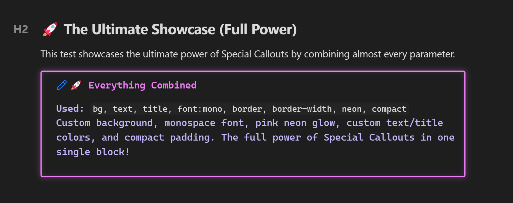

```markdown
> [!note] (bg:#0f0e17, text:#c4b5fd, title:#e879f9, font:mono, border:#e879f9, border-width:2, neon:#e879f9, compact) 🚀 Everything Combined
> Custom background, monospace font, pink neon glow, custom text/title colors, and compact padding. The full power of Special Callouts in one single block!
```

---

## Settings Panel

The plugin includes a rich visual settings panel accessible from **Settings → Special Callouts**.

### What you can do:

| Section | Features |
|---------|----------|
| **Quick Actions** | "How to Use" modal, "Metadata Reference" modal |
| **Custom Callouts** | Create, edit, delete custom style presets with live preview |
| **Quick Start Presets** | Ocean Deep, Neon Glow, Forest, Sunset — one-click templates |
| **Random Generator** | Generate a unique random style instantly |
| **Style Editor** | Name, icon picker, 5 color pickers, neon toggle, font dropdown, border controls, layout toggles |
| **Import/Export** | Share styles as JSON — copy to clipboard or paste to import |
| **Standard Callouts** | Modify default colors of built-in types (note, info, warning...) |
| **Standard Colors** | Edit hex values of named colors (red, blue, green...) |
| **Custom Colors** | Add your own named colors for use in any callout |


---

## Command Palette

Press `Ctrl/Cmd + P` and search for:

| Command | Description |
|---------|-------------|
| `Insert Custom Callout` | Browse and insert any saved custom style |
| `Insert "[style-name]"` | Directly insert a specific custom style |
| `Show Metadata Reference` | Open the full parameter reference |

> Assign **hotkeys** to your favorites in Settings → Hotkeys → Special Callouts.

---

## Installation

### From Community Plugins (Recommended)
1.  Open Obsidian Settings > **Community Plugins**
2.  Turn off **Restricted Mode**
3.  Click **Browse** and search for `Special Callouts`
4.  Click **Install** then **Enable**

### Manual Installation
1.  Download `main.js`, `styles.css`, and `manifest.json` from the [latest release](https://github.com/ahseyg/obsidian-special-callouts/releases)
2.  Create folder: `VaultFolder/.obsidian/plugins/obsidian-special-callouts/`
3.  Copy the downloaded files to the folder
4.  Enable the plugin in Obsidian settings

### Building from Source
```bash
git clone https://github.com/ahseyg/obsidian-special-callouts.git
cd obsidian-special-callouts
npm install
npm run build
```
Copy `main.js`, `styles.css`, and `manifest.json` to your vault's plugin folder.

---

## Contributing

This plugin is **open source** and we welcome contributions!

- **Bug Reports:** [Open an issue](https://github.com/ahseyg/obsidian-special-callouts/issues) — please include your Obsidian version, the callout markdown, and a screenshot
- **Feature Requests:** Same link — we'd love to hear your ideas!
- **Pull Requests:** Fork, branch, code, PR — all contributions are appreciated

### Project Structure
```
├── main.ts              # Plugin entry point
├── src/
│   ├── types.ts         # TypeScript interfaces
│   ├── constants.ts     # Default settings, colors, fonts
│   ├── parser.ts        # Metadata parser
│   ├── processor.ts     # Core callout processor
│   ├── utils.ts         # Utility functions
│   ├── modals/          # UI modals (How To, Metadata, Icon Picker, Suggester)
│   └── settings/        # Settings tab UI
├── styles.css           # Core CSS styles
├── manifest.json        # Plugin manifest
└── esbuild.config.mjs   # Build configuration
```

---

## License

MIT — See [LICENSE](LICENSE) for details.

---

<p align="center">
  Developed by <a href="https://github.com/ahseyg">ahseyg</a>
</p>
