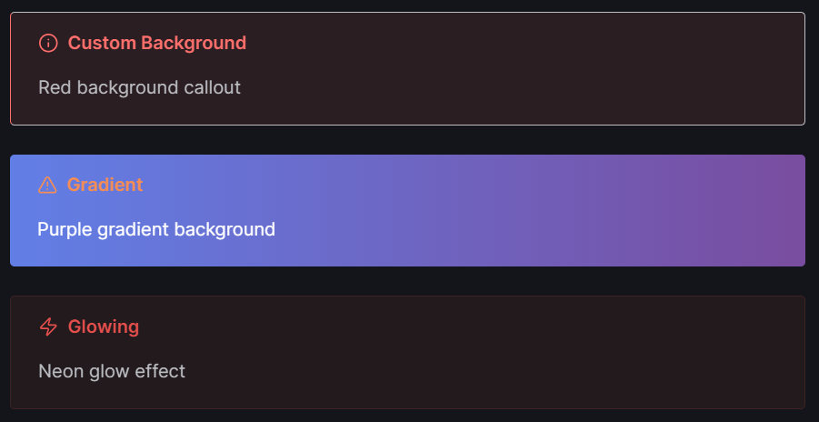
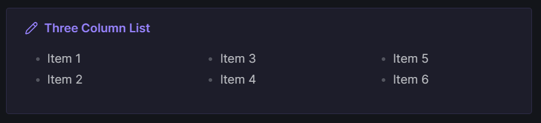

# Special Callouts

Advanced callout styling for Obsidian. Create grid layouts, custom colors, gradients, glow effects, and multi-column lists with simple inline syntax.

## Features

- **Grid Layouts** - Arrange callouts side-by-side with flexible column control
- **Custom Colors** - Use hex codes or define named colors
- **Gradient Backgrounds** - Smooth color transitions
- **Glow Effects** - Neon-style highlights for emphasis
- **Multi-Column Lists** - Newspaper-style content layout
- **Custom Styles** - Save and reuse your own callout designs

---

## Quick Start

### Grid Layout

Place callouts side-by-side using `(position, columns)` syntax:

```markdown
> [!multi-callout]
> 
> > [!note] (1,2) Left Panel
> > Content here
> 
> > [!tip] (2,2) Right Panel
> > Content here
```


---

### Colors and Effects

```markdown
> [!info] (bg:#ff6b6b) Custom Background
> Red background callout

> [!warning] (gradient:#667eea-#764ba2) Gradient
> Purple gradient background

> [!danger] (glow:5) Glowing
> Neon glow effect
```



---

### Multi-Column Lists

```markdown
> [!note] (col:3) Three Column List
> - Item 1
> - Item 2
> - Item 3
> - Item 4
> - Item 5
> - Item 6
```



---

## Syntax Reference

| Parameter | Example | Description |
|-----------|---------|-------------|
| `(pos,cols)` | `(1,3)` | Position 1 of 3 columns |
| `(pos,cols,row)` | `(1,2,2)` | Position 1, 2 cols, row 2 |
| `bg:` | `bg:#ff0000` | Background color |
| `text:` | `text:#ffffff` | Text color |
| `gradient:` | `gradient:#000-#fff` | Gradient background |
| `glow:` | `glow:5` | Glow intensity (1-10) |
| `col:` | `col:3` | List column count |
| `icon:` | `icon:rocket` | Lucide icon name |

---

## Settings

Access plugin settings to:

- Edit default color hex values (red, blue, green, etc.)
- Create custom named colors
- Design and save custom callout styles

---

## Installation

1. Download `main.js`, `styles.css`, and `manifest.json`
2. Create folder: `VaultFolder/.obsidian/plugins/special-callouts/`
3. Copy files to the folder
4. Enable the plugin in Obsidian settings

---

## License

MIT
